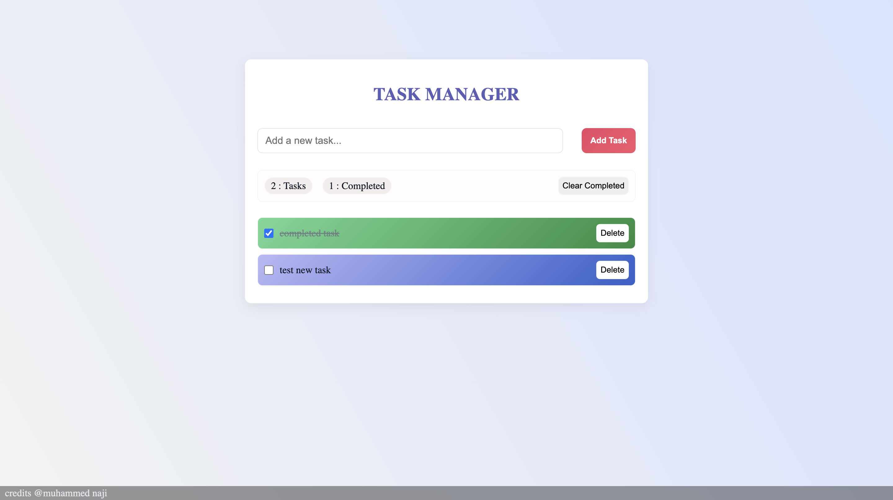

**📝 To-Do List Web App**

A simple, lightweight, and user-friendly To-Do List web application built using HTML, CSS, and JavaScript.
It helps you stay organized by letting you add, mark, and remove tasks — with everything saved locally in your browser.

**🌟 Features**

➕ Add new tasks

✅ Mark tasks as completed

❌ Delete individual tasks

🧹 Clear all completed tasks at once

💾 Automatically saves tasks in localStorage

🔁 Loads saved tasks when you reopen or refresh the page

📊 Shows total and completed task counts

**🗂️ Project Structure**

📦 ToDoList. 
  
 ┣ 📜 index.html      
 ┣ 🎨 style.css      
 ┗ ⚙️ script.js       

**🖥️ Getting Started**

Clone or download this repository:
```
git clone https://github.com/yourusername/todo-list-app.git
```

Open the project folder.

Run the app by opening index.html in your web browser.

Start adding your tasks! 🧾

**🛠️ Built With**

HTML5 – Structure

CSS3 – Styling and responsiveness

JavaScript (ES6) – Interactivity and logic

**🧑‍💻 Author**

Muhammed Naji
FullStack developer who enjoys building clean and interactive user interfaces.

**📸 Screenshot**

